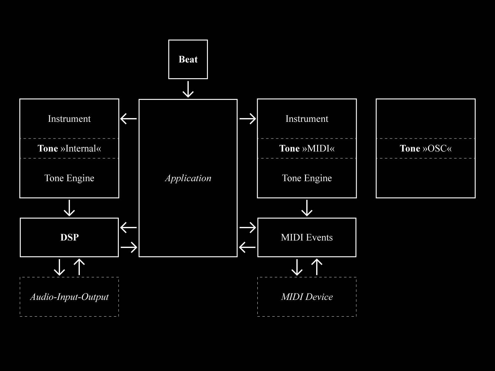
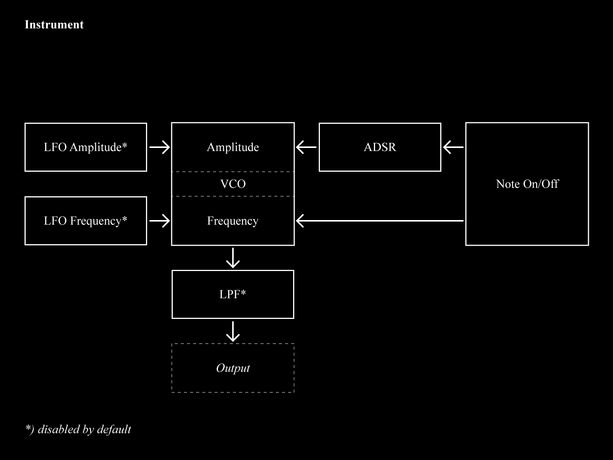

# Wellen

*wellen* is a framework for exploring and teaching generative music making and algorithmic compositions. it facilitates simple ways of playing musical notes, facilitates easy access to low-level digital signal processing (DSP) and supplies rhythm and timing as well as some *standard* muscial mechanics. the library acts as an adapter to various sound in- + outputs like MIDI, OSC, or digital/analog audio. the library is hosted on github [wellen](https://github.com/dennisppaul/wellen).

## Installation

the library can be installed as a [Processing library](https://processing.org/reference/libraries/) via the libray manager ( `Sketch > Import Library… > Add Library…` ) or by unpacking the `wellen.zip` archive into the Processing library folder. a step-by-step introduction to the library as well as extended applications can be found under `examples`.

### Dependencies

*wellen* makes use of the [oscP5](http://sojamo.de/code/) library to communicate over network with OSC ( see e.g `ExampleExternal04OSCToneEngine` ). the library can be installed via the processing library installer.

## Concepts

in the screencast series [Wellen](https://www.youtube.com/playlist?list=PLXJNr6N-Bu4NzkP4UJ5m-9721MdaZ6v-q) some of the examples are explained in more detail. the text below explains the core concepts of the *wellen* library:

### `Tone`

muscial notes can be played with a single call to `Tone.note_on(int, int)` and ended with `Tone.note_off(int)` ( see `ExampleBasics01Notes` ). each node is characterized by two parameters `pitch` and `velocity`. the value range conforms to MIDI standards.

by default a simple software-based synthesizer is used as a *tone engine* to produce the sound. however, there are quite a lot of options ( i.e an oscillator with different waveshapes, a low-pass filter (LPF), an attack-decay-sustain-release envelope (ADSR), and two low-frequency oscillators (LFOs) one for frequency and one for amplitude modulation ) to change the sound characteristics ( see `ExampleBasics05Instruments` + `ExampleInstruments01ADSR` ff. ). 

the default *tone engine* is monophonic i.e a single *instrument* can play only one note at a time. however, there are 16 instruments available which can be combined into a polyphonic setup with 16 voices. instruments are handled in a state machine i.e that an instrument selected with `Tone.instrument(int)` will remain selected until another instrument is selected. it is common to select an instrument right before turning a note on or off e.g `Tone.instrument(0); Tone.note_on(48, 85);`. note that other *tone engines* might be polyphonic e.g in some MIDI applications.

although `Tone` is designed to play musical notes ( arranged in half-tone steps ) triggered by the `note_on` + `note_off` paradigm, it can also be used to controll the frequency and amplitude of the generated sounds directly ( see `ExampleInstruments03FrequencyAndAmplitude` ).

this schematic summarizes the relation of the different components that comprise an instrument in *wellen*. all components can be dis- + enabled ( see `ExampleInstruments04LFOs` + `ExampleInstruments05LPF` ) and overridden to implement custom behaviors ( see `ExampleInstruments09CustomDSPInstrument` ).

*wellen* comes with mechanisms to send messages to other applications or machines via MIDI ( see `ExampleBasics06MIDI` ) or OSC ( see `ExampleExternal04OSCToneEngine` ) or can even use multiple *tone engines* at the same time ( see `ExampleExternal01MIDIToneEngineWithInternalToneEngine` ). likewise *wellen* can also receive events from other applications or machines with `EventReceiverMIDI` via MIDI and `EventReceiverOSC` via OSC ( see `ExampleExternal05ReceiveMIDIandOSC` ).

### `DSP`

*wellen* facilitates a mechanism for digital ( audio ) signal processing (DSP).

in the simplest setup the method `DSP.start(Object)` starts the signal processing pipeline which then continuously calls the method `audioblock(float[])`. the `float[]` array must be filled with samples that are then played back by the underlying audio infrastructure.

see `ExampleBasics04DSP` for a simple implementation of a *sine wave oscillator* as well as `ExampleDSP03Echo` for an implementations of slightly more advanced concept in DSP.

additionally DSP can also be started with different parameter sets to either run with stereo output ( see `ExampleDSP01StereoOutput` ), mono in- + output ( see `ExampleDSP02PassThrough` ) or stereo in- + output. additionally variations of the `DSP.start(...)` method allow to select other in- + output devices ( + sampling rate, audio block size, and number of in- + output channels ).

the default *tone engine* is designed to be optionally interfaced with `DSP`. this mechanism can e.g be used to apply an *effect* to played notes ( see `ExampleDSP09ToneEngineInternalWithDSP` ).

*wellen* comes with a series of handy classes to facilitate some fundamental DSP techniques. `Sampler` can be used to play back chunks of ( recorded ) memory at varying speed and direction ( see `ExampleDSP07Sampler` + `ExampleDSP10SampleRecorder` ). `Wavetable` is similar but designed to facilitate the emulation of oscillators with different wave shapes ( see `ExampleDSP05Wavetable` + `ExampleDSP06LFO` ). `ADSR` supplies an envelope to controll the amplitude of a signal over time. `LowPassFilter` allows the filtering of a signal with a resonance filter ( see `ExampleDSP04LPF` ). `Trigger` observes a continous signal and fires events whenever a rising or falling edge is detected; in conjunction with an oscillator it can be used to generate reoccuring events ( see `ExampleDSP08Trigger` ).

### `Beat`

*wellen* has a mechanism to trigger a continous beat. the method `Beat.start(Object, int)` starts a beat at a specified *beats per minute* (BPM) ( see `ExampleBasics03Beat` ). 

a beat can also be triggered by an external MIDI clock ( see `ExampleExternal02MIDIClock` ) to synchronize with other applications.

to synchronize a beat to `DSP` it can also be triggered by audio system requests ( see `ExampleDSP11BeatDSP` ).

### Other *Muscial* Techniques

with `Scale` values can be transformed into intervals based on musical scales ( see `ExampleBasics02Scales` ).

the `Sequencer` supplies a simple structure to facilitate the recording and recalling of note sequences ( see `ExampleTechnique01Sequencer` ). 

`Arpeggiator` works in a similar way but schedules a series of notes based on a predefined pattern and a base note.

## Reference

generated [reference](https://dennisppaul.github.io/wellen) of the library

## Setup Internal MIDI Communication 

### macOS

macOS provides a mechanism to send *virtual* MIDI messages internally. the technique is called *Inter-Application Communication* (IAC). IAC can be used to send and receive MIDI messages ( e.g `Note On/Off`, `Control Changes` + `MIDI Clock` ). to configure IAC follow the steps below:

- start application *Audio MIDI Setup* located in `/System/Applications/Utilities/Audio MIDI Setup.app`
- open *MIDI Studio* from menu `Window > Show MIDI Studio` ( or `CMD+2` )
- double click the icon `IAC Driver`
- check the box `Device is online`
- make sure there is at least one port in the `Ports` section ( default name is `Bus 1` )
- optionally add additional ports
- close *Audio MIDI Setup*

now the configured ports are avialable as virtual MIDI ports in macOS.

*Wellen* can list available MIDI ports with `Wellen.dumpMidiInputDevices()` + `Wellen.dumpMidiOutputDevices()`. the following examples demonstrate how to connect to MIDI devices, send and receive MIDI messages:

- `ExampleBasics06MIDI`
- `ExampleExternal01MIDIToneEngineWithInternalToneEngine`
- `ExampleExternal02MIDIClock`
- `ExampleExternal03MIDIExternalKeyboard`

<!-- @todo(windows+linux) -->
